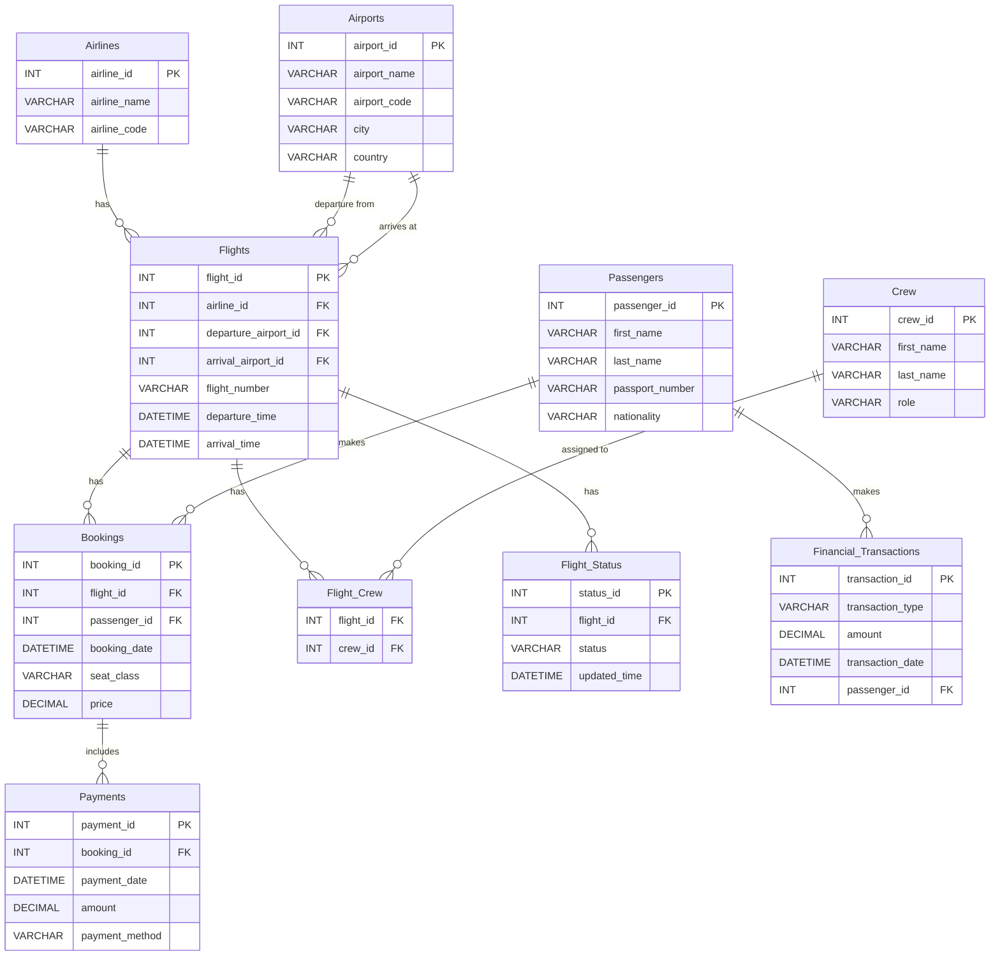

```mermaid
erDiagram
    Airlines {
        INT airline_id PK
        VARCHAR airline_name
        VARCHAR airline_code
    }

    Airports {
        INT airport_id PK
        VARCHAR airport_name
        VARCHAR airport_code
        VARCHAR city
        VARCHAR country
    }

    Flights {
        INT flight_id PK
        INT airline_id FK
        INT departure_airport_id FK
        INT arrival_airport_id FK
        VARCHAR flight_number
        DATETIME departure_time
        DATETIME arrival_time
    }

    Passengers {
        INT passenger_id PK
        VARCHAR first_name
        VARCHAR last_name
        VARCHAR passport_number
        VARCHAR nationality
    }

    Bookings {
        INT booking_id PK
        INT flight_id FK
        INT passenger_id FK
        DATETIME booking_date
        VARCHAR seat_class
        DECIMAL price
    }

    Crew {
        INT crew_id PK
        VARCHAR first_name
        VARCHAR last_name
        VARCHAR role
    }

    Flight_Crew {
        INT flight_id FK
        INT crew_id FK
    }

    Payments {
        INT payment_id PK
        INT booking_id FK
        DATETIME payment_date
        DECIMAL amount
        VARCHAR payment_method
    }

    Flight_Status {
        INT status_id PK
        INT flight_id FK
        VARCHAR status
        DATETIME updated_time
    }

    Financial_Transactions {
        INT transaction_id PK
        VARCHAR transaction_type
        DECIMAL amount
        DATETIME transaction_date
        INT passenger_id FK
    }

    Airlines ||--o{ Flights : "has"
    Airports ||--o{ Flights : "departure from"
    Airports ||--o{ Flights : "arrives at"
    Flights ||--o{ Bookings : "has"
    Passengers ||--o{ Bookings : "makes"
    Flights ||--o{ Flight_Crew : "has"
    Crew ||--o{ Flight_Crew : "assigned to"
    Bookings ||--o{ Payments : "includes"
    Flights ||--o{ Flight_Status : "has"
    Passengers ||--o{ Financial_Transactions : "makes"
```